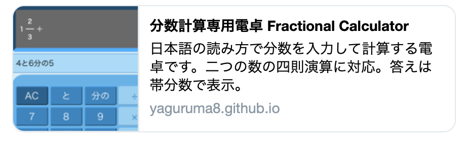
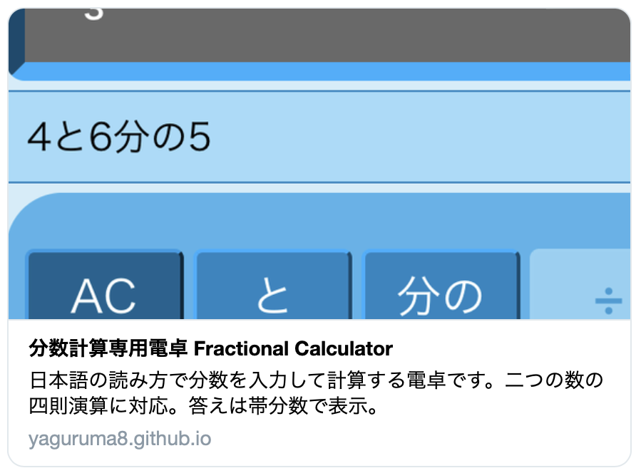

2022/6/11
# Twitteカードのmetaタグの設定方法

(英語公式) [Cards - About Twitter Cards](https://developer.twitter.com/en/docs/twitter-for-websites/cards/overview/abouts-cards)

(日本語) [ツイートをカードで最適化する](https://developer.twitter.com/ja/docs/tweets/optimize-with-cards/guides/getting-started)


 (例) 分数計算専用電卓 Fractional Calculator   
[分数計算専用電卓 Fractional Calculator](https://yaguruma8.github.io/fractional_calc/)    
[github](https://github.com/yaguruma8/fractional_calc)

## Summary Card

twitterカードのデフォルト



```html
<meta name="twitter:card" content="summary" />
<meta property="twitter:title" content="分数計算専用電卓 Fractional Calculator" />
<meta property="twitter:description" content="日本語の読み方で分数を入力して計算する電卓です。二つの数の四則演算に対応。答えは帯分数で表示。" />
<meta property="twitter:image" content="https://yaguruma8.github.io/fractional_calc/img/twittercard_img.png" />
```

必須項目（これがないとカードとして表示されない）
  - `<meta name="twitter:card"/>` : カードの種類
  - `<meta name="twitter:title"/>` : カードのタイトル(70文字以内）
      - 1byte文字基準のため日本語(2byte〜)ではおおよそ半分

必須ではないが、設定した方がいい項目
  - `<meta property="twitter:description"/>` : カードの説明(200文字以内)
    - `title`と同様1byte換算のため日本語ではおおよそ半分   
  - `<meta property="twitter:image"/>` : カードの画像URL

画像は**絶対パス**で書くこと。
  - (OK) `https://yaguruma8.github.io/fractional_calc/img/twittercard_img.png`
  - (NG) `img/twittercard_img.png`


Summary Card の場合、画像は1:1で表示される。
  - 画像の幅x高さ : 144x144~4096x4096
  - 画像サイズ : 5MB未満


(公式) [Cards - Summary Card](https://developer.twitter.com/en/docs/twitter-for-websites/cards/overview/summary)


## Summary Card with Large Image

画像を大きく表示できるカード



```html
<meta name="twitter:card" content="summary_large_image" />
<meta property="twitter:title" content="分数計算専用電卓 Fractional Calculator" />
<meta property="twitter:description" content="日本語の読み方で分数を入力して計算する電卓です。二つの数の四則演算に対応。答えは帯分数で表示。" />
<meta property="twitter:image" content="https://yaguruma8.github.io/fractional_calc/img/twittercard_img.png" />
```

リンクをより大きくしたい、画像を目立たせたいなどの場合はこちらを使用する。    

必須項目等は Summary と同じ

Summary Card with Large Image の場合、画像は2:1で表示される。
  - 画像の幅x高さ : 300x157~4096x4096
  - 画像サイズ : 5MB未満

(公式) [Cards - Summary Card with Large Image](https://developer.twitter.com/en/docs/twitter-for-websites/cards/overview/summary-card-with-large-image)

## カード用の画像について

画像は
  - Sammaryの場合は 1 : 1
  - Largeの場合は 2 : 1

で表示される。    
元画像がこの比率に従う必要はないが、比率が合っていない場合は中央から切り抜かれて表示される。   
上記の例でのカードの元画像は668x668ピクセルの1:1で、sammaryではすべて表示されているが、largeでは上下が切り落とされている。   
これは自動で行われて表示位置の制御はできないので、思ったように表示したいなら比率のあった画像を用意した方が良い。    
`<meta property="twitter:image"/>`を設定しない場合はTwitterの初期設定の画像が表示される。    


## MacのScreenShotを使ってカード用の画像を作成する場合の注意

Retinaディスプレイの場合、ScreenShotの「範囲を切り取る」の時に表示されるピクセル数と、実際のピクセル数（Previewなどで確認できる）は異なる。    
iMac 27" の場合、ScreenShotで幅400pxで切り抜いた場合、スクショされる画像はの実ピクセル数は幅800px（2倍)    
Twitterカードの画像の最大幅は**4096px**なので注意すること。   
Previewのツール＞サイズを調整... で変更可能


## カードが表示されるかの事前チェック

Twitter公式の Card Validator を使用するのが一番確実。アップロード直後などはエラーが出る場合もあるので、少し時間を置いてからチェックすること。

(公式) [Card validator](https://cards-dev.twitter.com/validator)

Slack など、リンクでカードを表示するアプリにURLを貼って確認することも可能。   
ただしTwitterでの見え方とは異なっていることも多いので注意する。

## OGPとの共存

SNSで表示するこの手のカードには`OpenGraph`という共通の規格があり、OGP(Open Graph Protocol)として共通化されている。    
TwitterカードもOGPに対応しているので、一部の項目を共通化することが可能。

Twitterの場合、
 - まず`<meta>`タグの`twitter: xxx`として設定されているものを探す。
 - 存在しない場合は、`og: xxx`として設定されているものを探す。

という順番で設定を探す。    
別のSNSにも表示されるように共通化する場合は、対応するプロパティを`og`に置き換える。   
`twitter:`と`og:`を両方設定することで、Twitter独自の設定をしつつ、Twitter以外のSNS用の表示を別に行うということも可能。    
タイトル・説明の文字数や、画像のサイズなど、SNSによって細かく異なるため、ターゲットに合わせて設定すること。

### 主な設定のフォールバック

| twitter property | og property | 説明 |
| - | - | - |
| twitter:card | og:type | カードの種類 |
| twitter:title | og:title | カードのタイトル |
| twitter:description | og:description | カードの説明 |
| twitter:image | og:image | カードの画像 |

[Cards Markup Tag Reference](https://developer.twitter.com/en/docs/twitter-for-websites/cards/overview/markup)


## 参考サイト（公式以外）

[OGPとは？OGPの基本からOGP画像のサイズや設定方法を分かりやすく解説](https://www.itra.co.jp/webmedia/what-is-ogp.html)


[【2021年版】OGPの設定方法と最適なOGP画像サイズまとめ](https://www.sungrove.co.jp/ogp-setting)