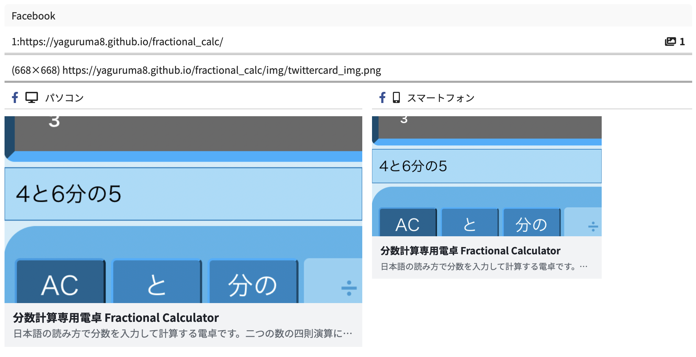
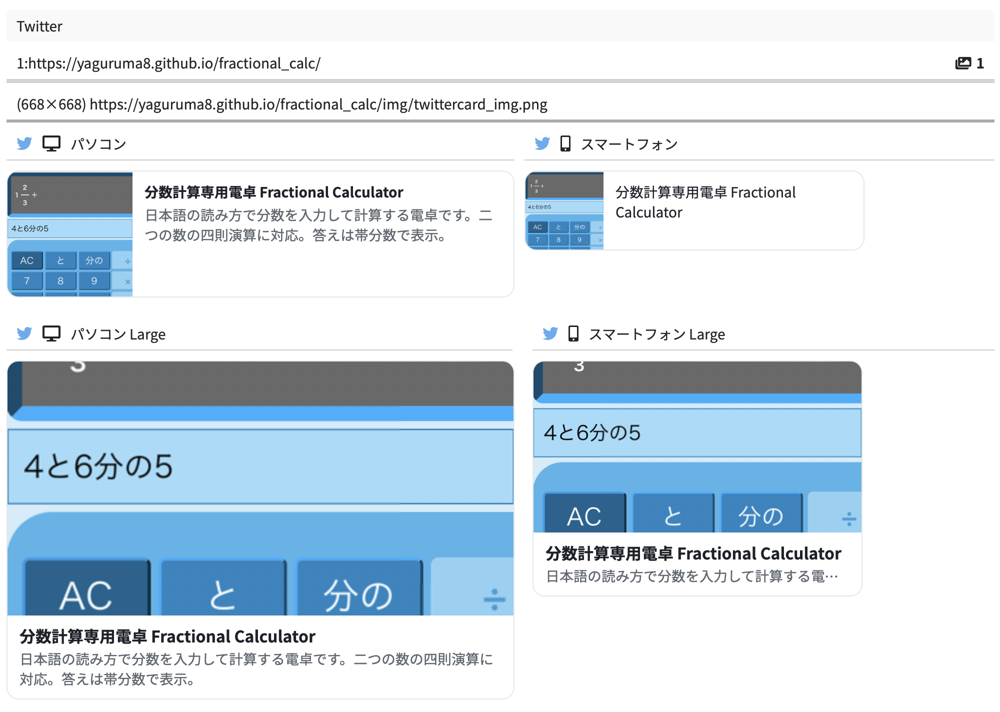
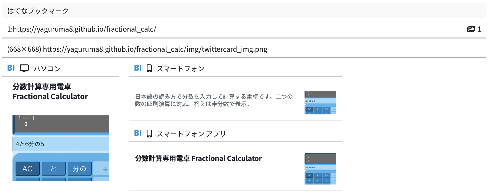
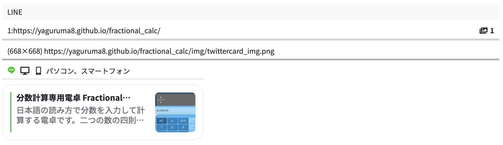

2022/6/18
# Twitteカードのmetaタグの設定方法(OGP対応)

22/6/11 [Twitteカードのmetaタグの設定方法](../220611/index.md)のOGP対応

---

(英語公式) [The Open Graph protocol](https://ogp.me)

(非公式日本語訳) [オープン・グラフ・プロトコル](https://www.asahi-net.or.jp/~ax2s-kmtn/internet/sns/ogp-20170727.html)

## 対応例

 (例) 分数計算専用電卓 Fractional Calculator   
[分数計算専用電卓 Fractional Calculator](https://yaguruma8.github.io/fractional_calc/)    
[github](https://github.com/yaguruma8/fractional_calc)

## 結論

### 最低限(これがないとカードとして認識されない)

```html
<!-- OGP -->
<meta property="og:type" content="website">
<meta property="og:title" content="分数計算専用電卓 Fractional Calculator">
<meta property="og:image" content="https://yaguruma8.github.io/fractional_calc/img/twittercard_img.png">
<meta property="og:url" content="https://yaguruma8.github.io/fractional_calc/">

<!-- Twitter -->
<meta name="twitter:card" content="summary_large_image">
```

OGP必須
  - `og:type` ... タイプ ※ Twitterとは異なり論理的な意味でのtype。
    - サイトのトップページなら`website`、各記事なら`article`など
  - `og:title` ... カードに表示するタイトル
  - `og:image` ... 画像。どのように表示されるかは実装によって異なる。**絶対パス**
  - `og:url` ... カードを踏んだ時に飛ぶURL。**絶対パス**

Twitter必須
  - `twitter:card` ... カードの表示タイプ。summaryもしくはsummary_large_image
  - `twitter:title` ... カードのタイトル。必須項目だが`og:title`があれば代わりに参照されるので削ってもOK

Twitterは`twitter:image`がなければ`og:image`を参照するので、カードの画像はOGPと兼用可能。


### 設定しておいた方がいい項目も含んだ一覧
```html
<!-- Twitter -->
<meta name="twitter:card" content="summary_large_image">
<meta name="twitter:title" content="分数計算専用電卓 Fractional Calculator">
<meta name="twitter:description" content="日本語の読み方で分数を入力して計算する電卓です。二つの数の四則演算に対応。答えは帯分数で表示。">
<meta name="twitter:image" content="https://yaguruma8.github.io/fractional_calc/img/twittercard_img.png">
<meta name="twitter:image:alt" content="分数計算専用電卓の見た目">

<!-- OGP -->
<meta property="og:type" content="website">
<meta property="og:title" content="分数計算専用電卓 Fractional Calculator">
<meta property="og:description" content="日本語の読み方で分数を入力して計算する電卓です。二つの数の四則演算に対応。答えは帯分数で表示。">
<meta property="og:image" content="https://yaguruma8.github.io/fractional_calc/img/twittercard_img.png">
<meta property="og:image:alt" content="分数計算専用電卓の見た目">
<meta property="og:url" content="https://yaguruma8.github.io/fractional_calc/">

<!-- オプション -->
<!-- Twitter:ページの作者名 -->
<meta name="twitter:site" content="@yaguruma8">

<!-- OGP:ページの言語 -->
<meta property="og:locale" content="ja_JP">
```
いくつかの項目（下記参照）はOGPで設定しておけばTwitterはそれを参照するが、実際にいくつかサイトを見た限りでは両方設定しているサイトが多かった。    

## TwitterカードとOGPの対応関係

| Twitter  | OGP | 説明 |
| - | - | - |
| twitter:card | og:type | カードの種類 |
| twitter:title | og:title | カードのタイトル |
| twitter:description | og:description | カードの説明 |
| twitter:image | og:image | カードの画像 |
| twitter:image:alt | og:image:alt | カードの画像の説明 |


## 画像のサイズについて

Twitterの場合、カードの表示は画像サイズによらず`twitter:card`が`summary`か`summary_large_image`かで決定される。    
各カードごとの画像サイズの上限下限は[Twitteカードのmetaタグの設定方法](../220611/index.md)参照。

FaceBookの場合、画像サイズが**600×315以上**の場合はTwitterの`summary_large_image`、それ以下なら`summary`と似た感じで表示される。    
小さい表示にしたい場合（画像は正方形で表示）は、200x200以上、600x315未満にする。

FacebookのOGP画像の推奨サイズは1200×630px。

## 表示の確認

[OGP確認](https://rakko.tools/tools/9/)

FaceBook, Twitter, はてなブックマーク, LINE    
PC/スマホごとの見え方を確認できる。    
ただしTwitterのCard validatorと少々表示が違う部分もあるので注意する。    

[OGP画像シミュレータ](https://www.ogimage.tsmallfield.com)

画像の切り取られ方を視覚的に確認できる。    


## 表示例

### Facebook


### Twitter


### はてなブックマーク


### LINE
