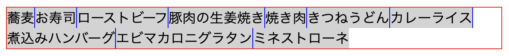
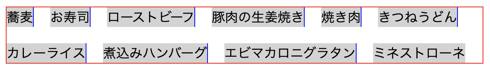
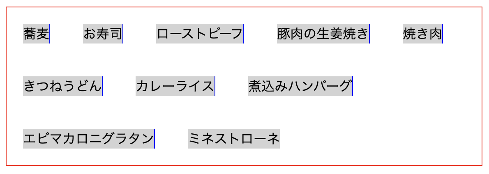
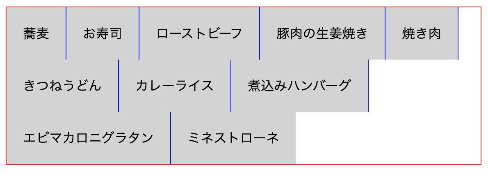
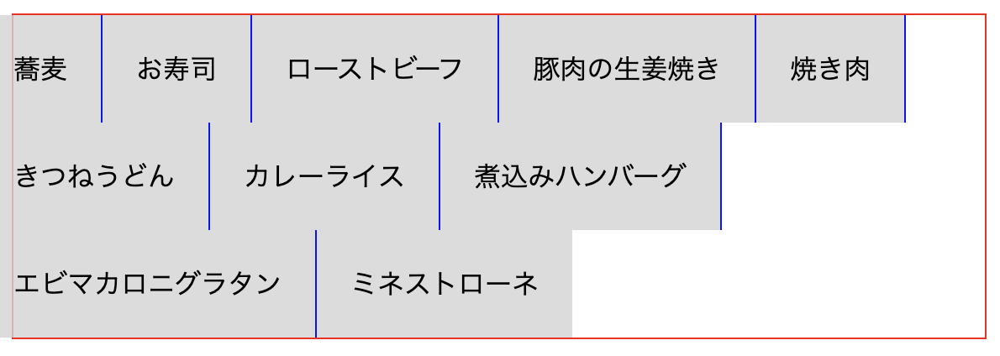
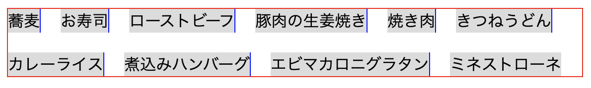
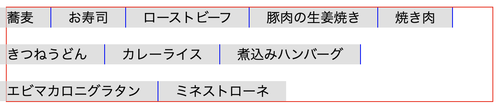

2023/2/23

# FlexBoxを折り返し可で並べるときの余白の記述方法のいろいろ覚書

```html
<div class="container">
  <ul class="flexbox">
    <li class="item">蕎麦</li>
    <li class="item">お寿司</li>
    <li class="item">ローストビーフ</li>
    <li class="item">豚肉の生姜焼き</li>
    <li class="item">焼き肉</li>
    <li class="item">きつねうどん</li>
    <li class="item">カレーライス</li>
    <li class="item">煮込みハンバーグ</li>
    <li class="item">エビマカロニグラタン</li>
    <li class="item">ミネストローネ</li>
  </ul>
</div>
```

```css
.container {
  border: 1px solid red;
  margin: 0;
  padding: 0;
}
.flexbox {
  display: flex;
  flex-wrap: wrap;
  margin: 0;
  padding: 0;
}
.item {
  background-color: lightgray;
  border-right: 1px solid blue;
  list-style-type: none;
  margin: 0;
  padding: 0;
}
.item:last-child {
  border-right: none;
}
```


---

## `.flexbox` に `gap`
```css
.flexbox {
  gap: 20px;
}
```


- item間に `border` で仕切り線などをつけない場合（写真を並べる時など）はこれが一番簡単でCSSも見やすい
- item同士のみに指定した幅の余白をつけられる
- 親の `.container` に対しては余白はつかない
- 比較的新しいので対応していないブラウザもあるので多少注意が必要
  - iPhone7のブラウザでは未対応だった（2023/2)

## `.item` に `margin`
```css
.item {
  margin: 20px;
}
```


- `.container` との間は **20px**
- item同士は20px＋20px＝ **40px** の余白
- FlexBoxのmarginは相殺されない？？
- いろいろ問題が多いしあまり美しくない

## `.item` に `padding`
```css
.item {
  padding: 20px;
}
```


- テキストメニュー等でメニュー間に `border` で仕切りをつけたい場合に、`.item` に余白を付けたい時もある。そのときの場合。
- item間の余白はこれで調整する
- ただし、一番左のitemの左側にも `padding` がつくため、ここを `.container` にくっついているように見せたい（左端を合わせる）場合は調整が必要

## `.item` に `padding` + `.flexbox` に `margin`（マイナスマージン）
```css
.item {
  padding: 20px;
}
.flexbox {
  margin: 0 -20px;
}
```


- `.item`の`padding`分を`.flexbox`の`margin`をマイナスにすることによって左側に移動して `.container`の左端に合わせる

## `margin` で `gap`と同じ見た目にする
```css
.item {
  margin: 10px;
}
.flexbox {
  margin: -10px;
}
```


- 空けたい余白分(20px)の1/2をitemの `margin`に指定
- その分を `flexbox` の `margin` にマイナスマージンをかけて打ち消す
- 指定した数字と実際に空いている余白に違いがあるため見づらい。 `gap`を使えるならその方がいいと思う

## `padding`を使って仕切り線をitem間の中央にしつつ左端を合わせる
```css
.item {
  margin: 10px 0;
  padding: 0 20px;
}
.flexbox {
  margin: -10px -20px;
}
```


- `.item`の `padding`の左右に `border` との間に取りたい余白(20px)をかける
- `.item`の `margin` に上下に取りたい余白(20px)の1/2をかける
- `.flexbox` の `margin` に、
   - 上下は `.item` の `margin` を打ち消すマイナスマージンをかけて上下を合わせる
   - 左右は `.item` の `padding` を打ち消すマイナスマージンをかけて左端を合わせる

